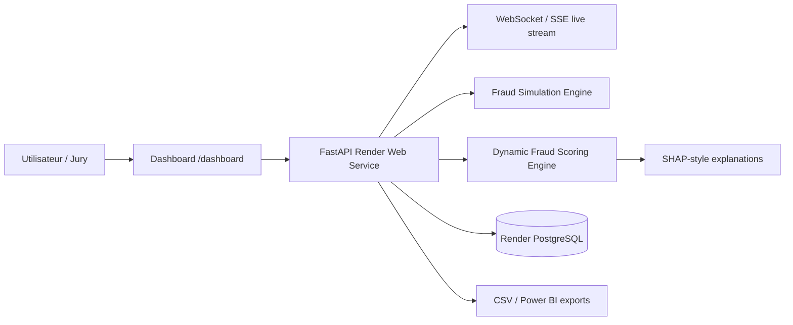

# Guide de deploiement Render - Fraud Detection Platform

Ce document explique comment deployer la plateforme complete dans le cloud avec Render.

Le dashboard live est deja integre dans FastAPI. Il est servi par l'API a l'URL :

```text
https://<ton-service-render>.onrender.com/dashboard
```

Cela signifie qu'un seul service Render suffit pour avoir :

- API FastAPI
- dashboard live
- WebSockets / Server-Sent Events
- simulation de transactions
- exports CSV / Power BI
- connexion PostgreSQL

---

## 1. Verifier le projet en local

Depuis le terminal VS Code :

```powershell
cd "D:\Projet\Codage\Projet PFE Code New"
.\.venv\Scripts\python.exe -m pytest -q
.\.venv\Scripts\python.exe -m uvicorn src.api.main:app --host 127.0.0.1 --port 8000
```

Puis ouvrir :

```text
http://127.0.0.1:8000/dashboard
http://127.0.0.1:8000/docs
```

Si le dashboard fonctionne localement, tu peux deployer.

---

## 2. Preparer GitHub

Render deploie depuis un repository GitHub.

```powershell
git status
git add .
git commit -m "Add enterprise fraud platform deployment guide"
git push origin main
```

Si ta branche n'est pas `main`, pousse la branche utilisee :

```powershell
git push origin nom-de-ta-branche
```

---

## 3. Methode recommandee : Render Blueprint

Le fichier [render.yaml](../render.yaml) est configure pour creer :

- une base PostgreSQL Render : `fraud-db`
- un service Web Docker : `fraud-platform`

Etapes :

1. Aller sur [Render](https://render.com).
2. Cliquer sur `New +`.
3. Choisir `Blueprint`.
4. Connecter ton repository GitHub.
5. Selectionner le repository du projet.
6. Render detecte automatiquement `render.yaml`.
7. Cliquer sur `Apply`.

Render va ensuite construire l'image Docker et lancer l'API.

---

## 4. Methode manuelle : Web Service + PostgreSQL

Si tu ne veux pas utiliser Blueprint :

### 4.1 Creer PostgreSQL

1. Render > `New +` > `PostgreSQL`.
2. Nom : `fraud-db`.
3. Plan : `Free` pour demo.
4. Region : proche de tes utilisateurs.
5. Copier la valeur `External Database URL` ou utiliser la liaison interne Render.

### 4.2 Creer le service API + dashboard

1. Render > `New +` > `Web Service`.
2. Connecter le repository GitHub.
3. Runtime : `Docker`.
4. Dockerfile path :

```text
./Dockerfile
```

5. Health check path :

```text
/health
```

6. Ajouter les variables d'environnement :

```text
PYTHONUNBUFFERED=1
ENABLE_SHAP=0
API_HOST=0.0.0.0
LOG_LEVEL=INFO
DATABASE_URL=<URL PostgreSQL Render>
```

Important : ne mets pas `API_PORT`. Render fournit automatiquement la variable `PORT`.

---

## 5. URLs apres deploiement

Quand Render termine le build, il donne une URL du type :

```text
https://fraud-platform.onrender.com
```

Les liens importants deviennent :

```text
Dashboard live:
https://fraud-platform.onrender.com/dashboard

Documentation API:
https://fraud-platform.onrender.com/docs

Health check:
https://fraud-platform.onrender.com/health

Transactions live:
https://fraud-platform.onrender.com/transactions?limit=300

Alertes fraude:
https://fraud-platform.onrender.com/fraud-alerts

Exports Power BI:
https://fraud-platform.onrender.com/api/v1/export/inventory
https://fraud-platform.onrender.com/api/v1/export/powerbi.zip
```

---

## 6. Lancer la simulation en production

Depuis Swagger UI :

```text
https://fraud-platform.onrender.com/docs
```

Utiliser :

```text
POST /customers/generate
POST /simulation/start
POST /simulation/stop
GET  /simulation/status
```

Exemple JSON pour generer des clients :

```json
{
  "count": 5000,
  "seed": 42,
  "persist": true
}
```

Exemple JSON pour demarrer la simulation :

```json
{
  "transactions_per_second": 10,
  "fraud_ratio": 0.08
}
```

Pour une demo Render Free, commence avec `10 TPS`. Les modes `100 TPS` et `1000 TPS` sont utiles pour demonstration locale ou serveur plus puissant.

---

## 7. Afficher le lien dashboard dans les logs Render

Dans Render, les logs affichent surtout l'URL du service. Pour rendre le lien tres clair, tu peux aussi l'ecrire dans ton README ou le terminal local :

```powershell
Write-Host "Dashboard Render: https://fraud-platform.onrender.com/dashboard"
```

En local :

```powershell
Write-Host "Dashboard local: http://127.0.0.1:8000/dashboard"
```

---

## 8. Connexion Power BI

Deux options :

### Option A - CSV exports

Telecharger :

```text
https://fraud-platform.onrender.com/api/v1/export/powerbi.zip
```

Importer les CSV dans Power BI Desktop.

### Option B - PostgreSQL direct

Dans Power BI Desktop :

1. `Get Data`
2. `PostgreSQL database`
3. Server : host PostgreSQL Render
4. Database : `fraud_db`
5. Authentification : user/password Render
6. Importer les tables :
   - `banking_transactions`
   - `banking_alerts`
   - `banking_customers`
   - `banking_shap_explanations`

Pour un memoire, l'option CSV est souvent plus simple et plus stable.

---

## 9. Depannage Render

### Le build echoue

Verifier :

- `Dockerfile` existe a la racine.
- `requirements-api.txt` contient bien `fastapi`, `uvicorn`, `sqlalchemy`, `psycopg2-binary`.
- Le repository GitHub contient `src/api/static/dashboard.html`.

### Le service demarre mais le dashboard ne s'affiche pas

Tester :

```text
https://fraud-platform.onrender.com/health
https://fraud-platform.onrender.com/
https://fraud-platform.onrender.com/dashboard
```

Si `/health` fonctionne mais pas `/dashboard`, verifier que `src/api/static/dashboard.html` a bien ete pousse sur GitHub.

### La base PostgreSQL ne se connecte pas

Verifier la variable :

```text
DATABASE_URL
```

Le code accepte les URLs Render en `postgres://...` et les convertit automatiquement en `postgresql+psycopg2://...`.

### La simulation est lente

Render Free peut dormir apres inactivite et a des ressources limitees. Pour une soutenance :

- ouvrir le dashboard 2 a 3 minutes avant la demo
- lancer `10 TPS`
- passer a `100 TPS` seulement si le service reste stable
- eviter `1000 TPS` sur Render Free

---

## 10. Architecture cloud



---

## 11. Checklist avant soutenance

- [ ] Le repository est pousse sur GitHub.
- [ ] Render build termine avec succes.
- [ ] `/health` retourne `status: ok`.
- [ ] `/dashboard` affiche la carte et les transactions.
- [ ] `/docs` est accessible.
- [ ] Les clients synthetiques sont generes.
- [ ] La simulation demarre depuis le dashboard ou Swagger.
- [ ] Les exports Power BI sont telechargeables.
- [ ] Une capture du dashboard est disponible dans `reports/`.
